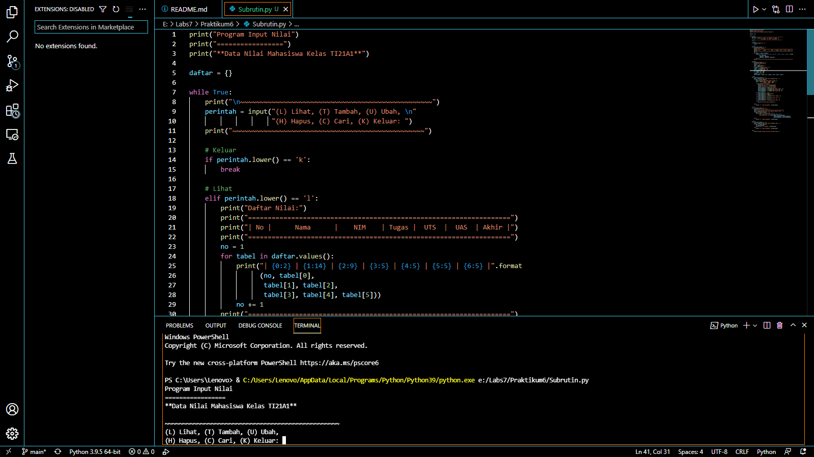
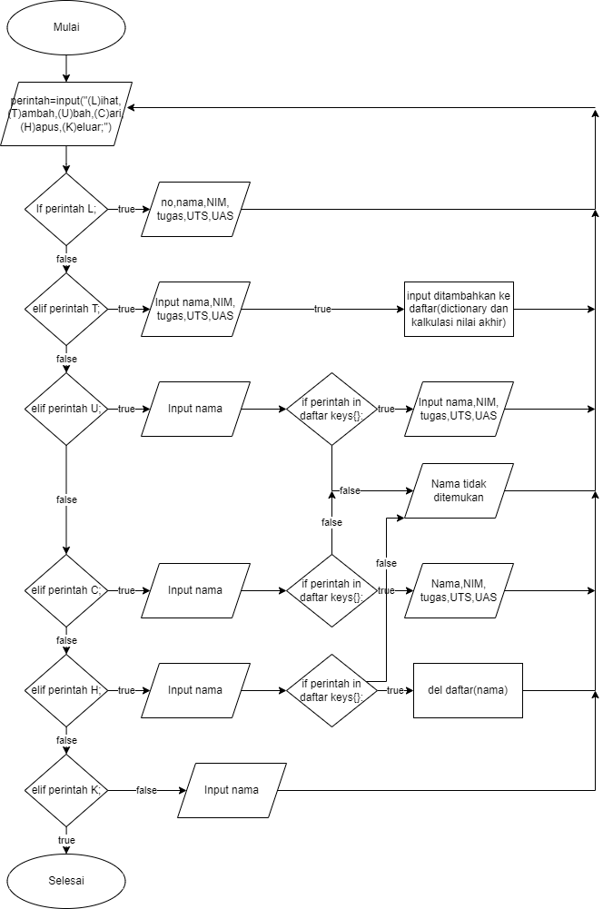

# Praktikum6
## Codingan Python

Membuat sebuah dictionary kosong yang akan diinput data.

Lalu membuat perulangan dan keterangan untuk pilihan menu yang akan dijalankan program.

Membuat syntax untuk menambahkan data.Apabila menginputkan 't' maka akan diminta untuk menginputkan beberapa data. Data yang diinput akan masuk ke dictionary 'x' yang telah dibuat dengan data nama sebagai kunci dan sisanya sebagai value nya.

Membuat syntax untuk mengubah data. Apabila input 'u' akan ada keterangan untuk mengubah data dan diminta untuk menginputkan nama yang akan diubah data tsb, jika nama tidak ada maka outputnya "Nama {} tidak ditemukan". Dimana {} adalah nama/data yang nanti akan diubah.

Buat syntax menghapus data.

Input 'h' akan diminta menginput nama yang akan dihapus. Jika nama ada di dalam dictionary, maka system akan menghapus kunci/nama itu dan value nya pada statement del x[nama].

Buat syntax mencari data.

Input 'c' akan diminta untuk memasukkan nama yang dicari. Jika nama yang dicari ada di dalam dictionary maka outputnya akan menampilkan data dari nama itu.

Buat syntax Menampilkan data.

Input 'l' maka sistem akan menampilkan data - data yang sudah di masukkan. Apabila data belum dimasukkan maka outputnya menjadi "SILAKAN MASUKAN PERINTAH TERLEBIH DAHULU".

Buat syntax Menghentikan perulangan.

Input 'k' maka program akan langsung berhenti.

Buat syntax agar memilih pilihan yang tidak ada di menu.
### Flowchart
